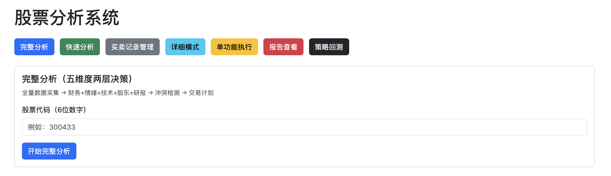
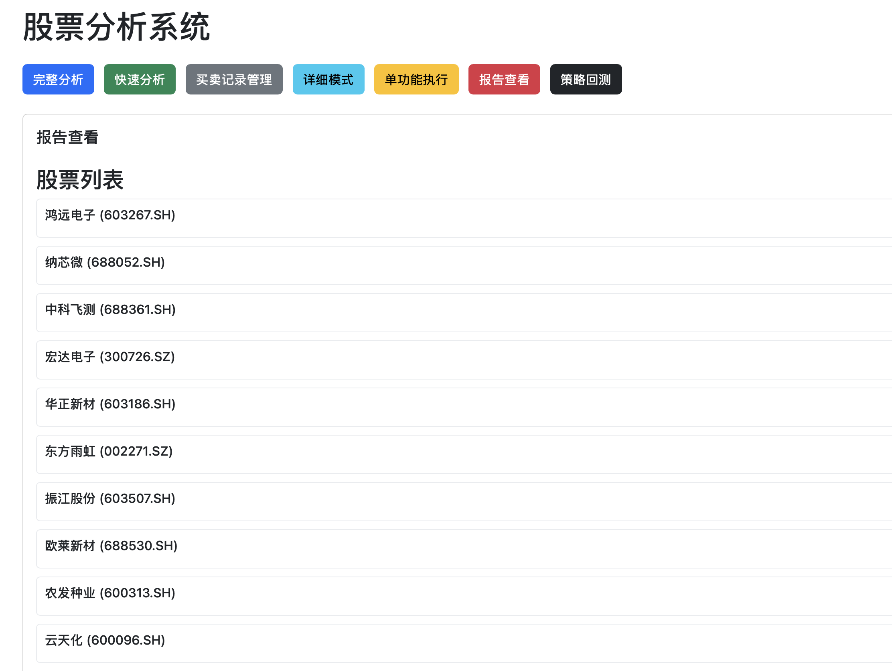
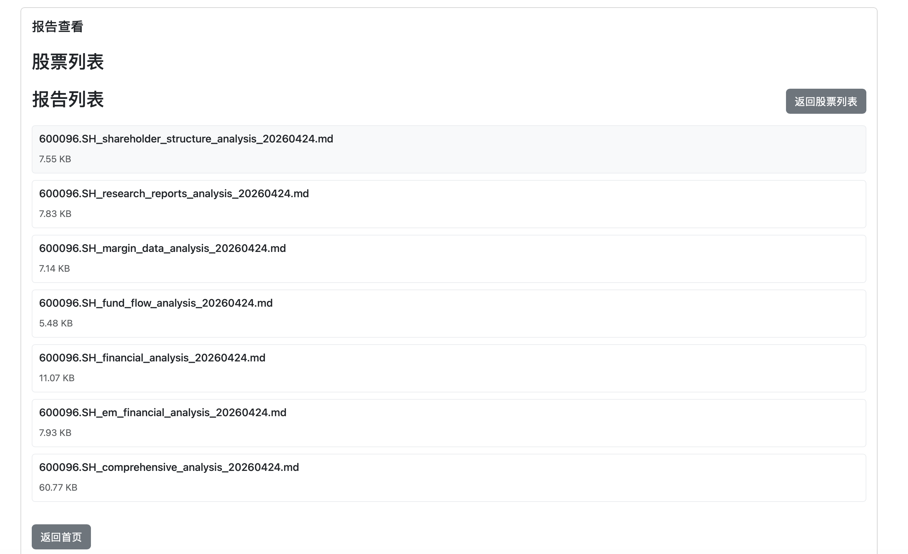
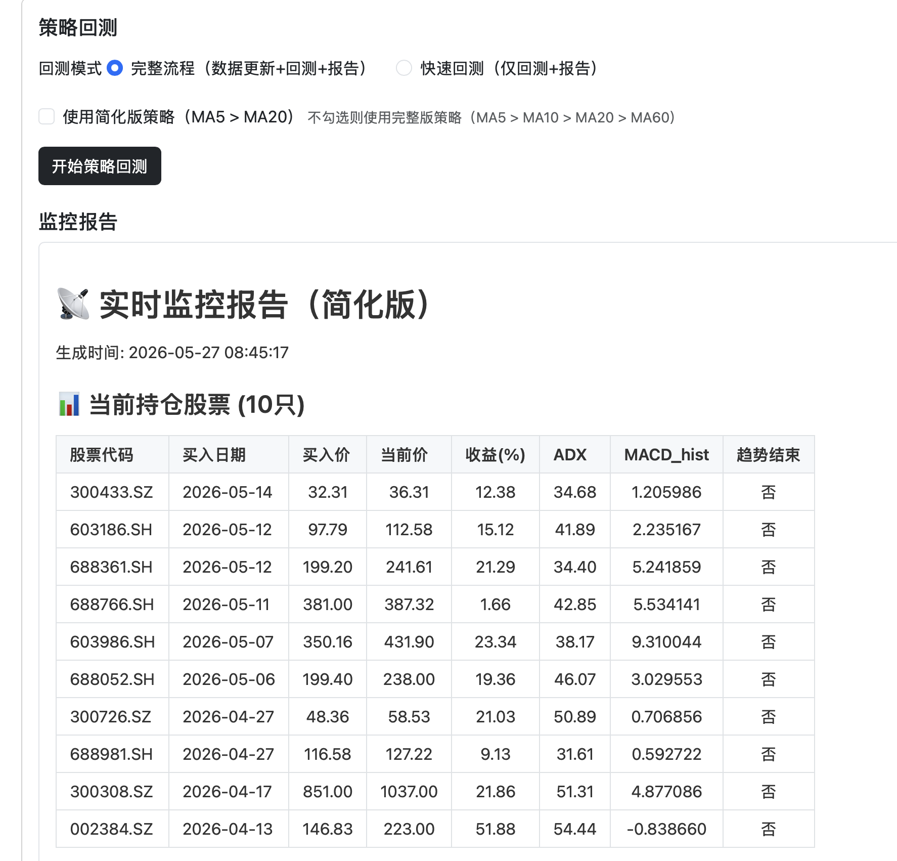

# GP_ANA — A 股 AI 综合分析系统

**当前版本：v1.4.0**

<p align="center">
  
  
  
  
</p>

---

## 📖 项目摘要

**GP_ANA** 是一款面向 A 股市场的全流程量化投资与 AI 辅助决策系统。它打通了"数据采集 → 技术分析 → 策略回测 → AI 多维研判 → 交易决策"的完整链路，并通过 Flask Web 界面提供一站式的可视化操作体验。

**核心流程：** 从东方财富、akshare、雪球等多源采集 20+ 类数据 → 覆盖财务、情绪估值、技术趋势、股东结构、研报观点五大维度的结构化分析 → 本地 LLM（Ollama）或云端大模型（OpenAI/DeepSeek/通义千问）进行两层 AI 决策 → 自动生成交易计划与 20+ 种专业分析图表。

**适用人群：** 希望用数据驱动决策的个人投资者、量化策略研究者、以及需要批量跟踪多只股票的活跃交易者。

---

## ✨ 为什么选择 GP_ANA？

| 特性 | 传统炒股软件 | **GP_ANA** |
|:---|:---|:---|
| 数据来源 | 单一平台 | **20+ 采集器**，东方财富/akshare/雪球多源融合 |
| 分析维度 | 仅 K 线 | **五大维度**：财务 + 情绪估值 + 技术趋势 + 股东结构 + 研报观点 |
| AI 决策 | ❌ | ✅ **两层 AI 决策**：冲突检测 + 交易计划，支持 Ollama/OpenAI/DeepSeek |
| 策略验证 | 手动复盘 | **自动回测**，趋势跟踪/均值回归/波段三种策略 |
| 可视化 | 固定模板 | **20+ 种专业图表**，价格/成交量/布林带/相关性/信号分析/趋势通道... |
| 板块分析 | 手动翻看 | **四大板块类型**（大盘/行业/概念/港股）AI 深度分析，自动技术指标+LLM 报告 |
| 批量处理 | 逐个操作 | **一键批量**分析多只股票 |

---

## 🖥️ 界面预览

### Web 主界面


### 分析报告列表


### 分析报告细则


### 策略回测


| 特性 | 传统炒股软件 | **GP_ANA** |
|:---|:---|:---|
| 数据来源 | 单一平台 | **20+ 采集器**，东方财富/akshare/雪球多源融合 |
| 分析维度 | 仅 K 线 | **五大维度**：财务 + 情绪估值 + 技术趋势 + 股东结构 + 研报观点 |
| AI 决策 | ❌ | ✅ **两层 AI 决策**：冲突检测 + 交易计划，支持 Ollama/OpenAI/DeepSeek |
| 策略验证 | 手动复盘 | **自动回测**，趋势跟踪/均值回归/波段三种策略 |
| 可视化 | 固定模板 | **20+ 种专业图表**，价格/成交量/布林带/相关性/信号分析/趋势通道... |
| 板块分析 | 手动翻看 | **四大板块类型**（大盘/行业/概念/港股）AI 深度分析，自动技术指标+LLM 报告 |
| 批量处理 | 逐个操作 | **一键批量**分析多只股票 |

---

## 📊 可视化能力

GP_ANA 为每只股票自动生成 **20+ 种专业级分析图表**，无需任何配置：

### 市场数据可视化

| 图表类型 | 文件名示例 | 说明 |
|:---|:---|:---|
| 🕯️ **价格成交量** | `price_volume.png` | K 线 + 成交量柱状图 + 均线系统 |
| 📈 **技术指标面板** | `technical_indicators.png` | 多面板展示 MA/RSI/MACD/KDJ/CCI/ROC/WR 等 16 项指标 |
| 🎚️ **布林带** | `bollinger_bands.png` | 布林带 + 价格走势，识别超买超卖 |
| 🔗 **相关性热力图** | `correlation.png` | 全部技术指标相关性矩阵 |

### 策略与信号

| 图表类型 | 文件名示例 | 说明 |
|:---|:---|:---|
| 📡 **信号分析** | `signal_analysis.png` | 各技术指标的买卖信号分布与有效性评估 |
| 📊 **策略回测结果** | `strategy_results.png` | 资金曲线 + 买卖点标注 + 收益率/夏普比率/最大回撤 |
| 🏔️ **支撑阻力位** | `support_resistance.png` | AI 识别的关键支撑/阻力位，含成交密集区 |
| 📐 **趋势通道** | `trend_channel_results.png` | 自动检测趋势通道，标记突破/回归信号 |

### AI 预测

| 图表类型 | 文件名示例 | 说明 |
|:---|:---|:---|
| 🔮 **AI 价格预测** | `ai_predictions.png` | 机器学习模型对未来 N 日价格预测 |
| ⭐ **特征重要性** | `feature_importance.png` | 各技术指标对预测的贡献度排序 |
| 🧠 **AI 综合预测** | `prediction.png` | LLM 增强的综合趋势预判 |

### 回测系统

| 图表类型 | 文件名示例 | 说明 |
|:---|:---|:---|
| 📈 **回测收益曲线** | `backtest_YYYYMMDD.png` | 每次回测的完整收益曲线 + 交易标记 |

> 所有图表自动保存至 `./data/{ticker}/` 目录，既可在 Web 界面在线查看，也可导出用于报告。

---

## 🎯 核心能力

```
┌──────────────────────────────────────────────────────────────┐
│                     📡 数据采集层                              │
│   20+ 采集器：行情 / 财务 / 资金流 / 融资融券 / 股东 / 行业 / 研报   │
│   + 板块数据：大盘指数 / 行业板块 / 概念板块 / 港股指数             │
└──────────────────────────┬───────────────────────────────────┘
                           ▼
┌──────────────────────────────────────────────────────────────┐
│                     🔬 五维度分析引擎 + 板块分析                  │
│   个股：财务(25%) + 情绪估值(15%) + 技术趋势(40%)                │
│   + 股东结构(10%) + 研报观点(10%)                               │
│   板块：技术指标 + LLM 深度分析（single/broad 双模式）            │
│   每个维度 → 结构化 JSON → LLM 深度分析                         │
└──────────────────────────┬───────────────────────────────────┘
                           ▼
┌──────────────────────────────────────────────────────────────┐
│                     🧠 两层 AI 决策                            │
│   第一层：五维度冲突检测 → 识别多空矛盾信号                       │
│   第二层：结合持仓信息 → 生成具体交易计划（买入/卖出/持有）          │
└──────────────────────────┬───────────────────────────────────┘
                           ▼
┌──────────────────────────────────────────────────────────────┐
│              📊 可视化 & 📈 策略回测 & 🌐 Web 界面               │
│   20+ 图表 / 3 种策略模式 / Flask Web UI (localhost:8081)       │
└──────────────────────────────────────────────────────────────┘
```

---

## 🚀 快速开始

### 1. 环境准备

```bash
# 安装依赖
pip install -r requirements.txt

# 安装 Ollama（本地 AI 分析）
# 访问 https://ollama.com 下载安装
ollama pull qwen3

# 复制配置文件
cp config.example.py config.py
```

### 2. 启动 Web 界面

```bash
python web_ui.py
# 浏览器打开 → http://localhost:8081
```

### 3. 开始分析

| 模式 | 操作 | 耗时 | 适用场景 |
|:---|:---|:---|:---|
| 🔍 **完整分析** | 点击"完整分析"，输入股票代码 | 3-5 分钟 | 新股票，首次全面评估 |
| ⚡ **快速分析** | 点击"快速分析"，选择策略视角 | 30 秒 | 每日盘后快速复盘 |
| 📊 **策略回测** | 点击"回测"，选择策略参数 | 1-2 分钟 | 验证交易策略有效性 |
| 🏢 **板块分析** | 点击"板块分析"，选择板块类型和代码 | 2-3 分钟 | 大盘/行业/概念/港股 AI 深度分析<br>⚠️ **首次使用需先点击"更新板块数据"** |

---

## ⚙️ 配置

```python
# config.py — 核心配置
STOCK_TICKERS = {
    'your_stock': '002594.SZ',   # 添加你要跟踪的股票
}

AI_CONFIG = {
    'base_url': 'http://localhost:11434',  # Ollama 本地服务
    'model': 'qwen3',                       # 本地模型
    'trading_strategy': 'neutral',          # trend_following / mean_reversion / swing / neutral
    'fallback_models': ['qwen3'],           # 备用模型
}
```

---

## 📦 依赖项

```
pandas  numpy  matplotlib  seaborn  yfinance  akshare
TA-Lib  scikit-learn  schedule  requests  flask
```

---

## 📂 程序分类

> 以下是完整的模块清单，供查阅参考。

### 1. 数据抓取类

| 程序名称 | 功能 | 数据源 | 输出物 |
|---------|------|--------|--------|
| `data_collector.py` | 历史行情数据（前复权） | akshare | `{ticker}_qfq.csv` |
| `stock_market_data_collector.py` | 资金流、融资融券、估值数据 | akshare | `{ticker}_fund_flow.csv` / `_margin_data.csv` / `_valuation.csv` |
| `stock_company_info_collector.py` | 公司基本信息、研报、股东、财务报表 | akshare | `{ticker}_company_basic.json` / `_research_reports.csv` 等 |
| `eastmoney_fetcher.py` ⭐ | **统一东方财富数据抓取入口** (`--type market_performance\|industry_valuation\|industry_peers\|industry_growth\|dupont`) | 东方财富 API | 各类行业/市场数据 |
| `financial_indicators_collector.py` | 财务指标、成长指标、现金流指标 | akshare | `{ticker}_financial_indicators.json` |
| `shareholders_collector.py` | 前十大股东历史数据 | 东方财富 API | `{ticker}_historical_shareholders.csv` |
| `shareholder_num_collector.py` | 股东户数、户均持股 | 东方财富 API | `{ticker}_shareholder_num.csv` |
| `north_holdings.py` | 北向资金持股 | 东方财富 API | `{ticker}_north_holdings.csv` |
| `org_hold_collector.py` | 机构持仓明细 | 东方财富 API | `{ticker}_institutional_holdings.csv` |
| `em_financial_collector.py` | 东方财富财务数据 | 东方财富 API | `{ticker}_dupont_data.csv` / `_growth_ratio_data.csv` |
| `important_missing_data_collector.py` | 业绩预告与分红数据 | 多数据源 | `{ticker}_performance_forecast.csv` / `_ex_dividend.csv` |
| `shenwan_industry_collector.py` | 申万行业分类 | 东方财富 API | `{ticker}_industry_info.json` |
| `batch_margin_collector.py` ⭐ | 批量融资融券数据采集 | akshare | 多股票 `_margin_data.csv` |
| `sector_data_collector.py` ⭐ | **板块数据采集** — 大盘指数/行业/概念/港股，新浪财经+东方财富 | akshare / 新浪 | `data/sector/{type}/{code}/` |

### 2. 数据分析类

| 程序名称 | 功能 | 输出物 |
|---------|------|--------|
| `analyze_financial_statements.py` | 财务报表 AI 分析 | `{ticker}_financial_analysis_{timestamp}.md` |
| `analyze_fund_flow.py` | 资金流 AI 分析 | `{ticker}_fund_flow_analysis_{timestamp}.md` |
| `analyze_margin_data.py` | 融资融券 AI 分析 | `{ticker}_margin_data_analysis_{timestamp}.md` |
| `analyze_research_reports.py` | 研究报告 AI 分析 | `{ticker}_research_reports_analysis_{timestamp}.md` |
| `analyze_shareholder_structure.py` | 股东结构 AI 分析 | `{ticker}_shareholder_structure_analysis_{timestamp}.md` |
| `analyze_valuation_data.py` | 估值 AI 分析 | `{ticker}_valuation_analysis_{timestamp}.md` |
| `analyze_technical_trend.py` | 技术趋势 AI 分析（支持 `--strategy` 切换策略视角） | `{ticker}_technical_trend_analysis.json` |
| `analyze_em_financial.py` | 东方财富财务 AI 分析 | 财务分析报告 |
| `analyze_performance_forecast.py` | 业绩预测 AI 分析 | 业绩预测分析报告 |
| `analyze_peer_comparison.py` | 同行对比 AI 分析 | 同行对比分析报告 |
| `analyze_sector.py` ⭐ | **板块 AI 分析** — 单板块深度/大盘全景双模式 | 板块分析报告 |
| `calculate_financial_indicators.py` | 综合财务指标计算（盈利能力/偿债能力/运营能力/现金流/成长能力） | `{ticker}_financial_indicators_calculated.json` |
| `calculate_technical_trend_ds.py` ⭐ | 技术趋势分析计算 | 技术趋势分析数据 |
| `daily/data_analysis.py` | 数据质量检查 + 可视化（16 项指标含 OBV/ATR/ADX/MFI） | 价格/成交量/布林带/相关性图表 |
| `daily/technical_analysis.py` | 技术指标信号分析与有效性评估 | 信号分析图表 |
| `daily/quantitative_strategy.py` | 量化策略回测 | 策略回测图表 + 交易信号 CSV |
| `daily/strategy_optimization.py` | 策略参数优化 | 优化结果图表 |
| `daily/trend_channel_analyzer.py` | 趋势通道分析 | 趋势通道图表 + 信号 CSV |
| `daily/stock_quantitative_analyzer.py` | 股票量化综合分析 | 分析 CSV + 图表 |
| `daily/ai_model.py` | AI 预测模型训练与推理 | AI 模型文件 |
| `daily/stock_prediction.py` | 股票价格预测 | 预测结果图表 |
| `daily/stock_daily_indicator_calculator.py` | 日线综合指标计算 | `{ticker}_daily_indicators.csv` |
| `daily/daily_strategy_optimization_multistock.py` | 多股票策略参数优化 | 优化结果 CSV + 图表 |
| `daily/daily_trend_strategy.py` | 日线趋势跟踪策略 | 策略信号 CSV |
| `weekly/` | 周线分析（数据检查/策略回测/优化/综合分析/AI预测） | 周线分析报告 |

### 3. Process/ 分析引擎 ⭐ (v1.2 新增)

五维度 JSON 摘要 + 两层决策系统：

| 模块 | 功能 |
|------|------|
| `Process/financial_structured_analyzer.py` | 财务数据 → 结构化 JSON（盈利能力/成长性/风险） |
| `Process/sentiment_valuation_analyzer.py` | 情绪 + 估值 → JSON（市场情绪/估值分位/技术情绪） |
| `Process/shareholder_structure_analyzer.py` | 股东结构 → JSON（集中度/机构动向/北向资金） |
| `Process/research_report_analyzer.py` | 研报观点 → JSON（评级分布/目标价/关键观点） |
| `Process/two_layer_decision_analyzer.py` | **两层决策** — 冲突检测 + 持仓交易计划 |
| `Process/multi_strategy_analyzer.py` | 多策略 LLM 分析（趋势跟踪/均值回归/波段） |
| `Process/financial_analysis_enhancer.py` | 财务分析增强 — 深度解读财务指标关联与异常 |

### 4. AI / LLM 分析类

| 程序名称 | 功能 |
|---------|------|
| `stock_ai_comprehensive_analyzer.py` | 综合各维度分析报告 → AI 大模型综合分析（支持本地 Ollama / 第三方 API） |
| `daily/stock_ai_local_analyzer.py` | K 线数据 → AI 日线分析 + 支撑阻力位图表 |
| `weekly/weekly_stock_ai_local_analyzer.py` | 周线数据 → AI 周线分析 |

### 5. 回测系统 ⭐

| 程序名称 | 功能 |
|---------|------|
| `trend_following_backtest.py` | 趋势跟踪策略回测引擎 |
| `backtest_all_stocks.py` | 全股票批量回测 |

### 6. Web 界面 & API

| 程序名称 | 功能 |
|---------|------|
| `web_ui.py` | Flask Web 主界面（`http://localhost:8081`） |
| `api/analysis.py` | 完整分析 API（全量数据 + 五维度 + 两层决策） |
| `api/quick_analysis.py` ⭐ | 快速分析 API（仅 K 线 + 技术趋势，三种策略视角） |
| `api/backtest.py` ⭐ | 回测 API |
| `api/detailed.py` | 详细模式 API（单步数据抓取/分析/查询） |
| `api/trading.py` | 交易记录管理 API |
| `api/report_viewer.py` | 报告查看 API |
| `api/common.py` ⭐ | 共享模块（交易所映射、任务队列、步骤执行引擎） |
| `api/sector.py` ⭐ | **板块分析 API** — 数据采集/分析触发/状态轮询/报告获取 |

### 7. 工具 & 配置

| 文件名 | 功能 |
|-------|------|
| `config.py` | 系统配置（股票代码、AI模型、技术指标参数、策略参数） |
| `requirements.txt` | Python 依赖包列表 |
| `utils.py` | 通用工具函数（日期处理、文件操作、日志等） |
| `check_data_updates.py` | 统一数据更新检查（`--mode daily\|periodic`） |

---

## 命令行使用

```bash
# 统一批量分析
python batch_analyze.py --mode periodic --ticker 300433.SZ
python batch_analyze.py --mode daily --ticker 300433.SZ

# 统一数据抓取
python eastmoney_fetcher.py --type market_performance --ticker 300433.SZ
python eastmoney_fetcher.py --type dupont --ticker 300433.SZ

# 数据更新检查
python check_data_updates.py --mode daily --ticker 300433.SZ
python check_data_updates.py --mode periodic --ticker 300433.SZ

# 技术趋势分析（切换策略视角）
python analyze_technical_trend.py --strategy trend_following --ticker 300433.SZ
python analyze_technical_trend.py --strategy swing --ticker 300433.SZ

# 板块分析
python sector_data_collector.py --type broad_index                # 采集大盘指数数据
python sector_data_collector.py --type industry --top 30           # 采集行业板块数据
python analyze_sector.py --mode single --sector BK0477             # 单板块深度分析
python analyze_sector.py --mode broad                              # 大盘全景分析
```

---

## 版本历史

| 版本 | 日期 | 主要变更 |
|------|------|---------|
| **v1.3.0** | 2026-06 | 板块分析：四大类型 AI 分析、新浪财经数据源、sector API |
| **v1.2.0** | 2026-05 | 架构重构：统一入口、Process/引擎、两层决策、快速分析、回测系统 |
| v1.1.0 | 2026-03 | 41 模块：Web 界面、12 个新采集器、5 个新分析引擎 |
| v1.0.1 | 2026-02 | 18 模块：数据采集 + 基础分析 |

详见 [CHANGELOG.md](CHANGELOG.md)

---

## 注意事项

- 国内股票优先使用 akshare 数据源
- 技术指标计算需要 TA-Lib 库支持
- 本地 AI 分析需要部署 [Ollama](https://ollama.com/) 服务
- **板块分析首次使用**：板块列表初始为空，需先在 Web 界面点击"更新板块数据"或命令行运行 `python sector_data_collector.py --type broad_index` / `--type industry` 采集数据后，板块列表才会显示可分析的板块
- 所有数据采集程序采用增量保存，避免数据丢失
- 数据文件存储在 `./data/{ticker}/` 目录下
- `config.py` 和 `trading_records.py` 包含敏感信息，已加入 `.gitignore`

---

<p align="center">
  <sub>Made with ❤️ for quantitative investors</sub>
</p>
