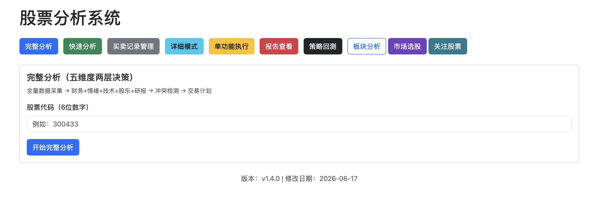
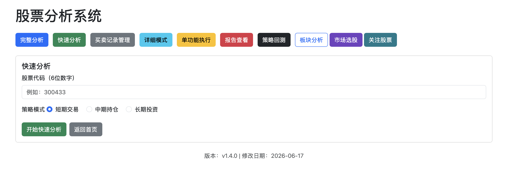
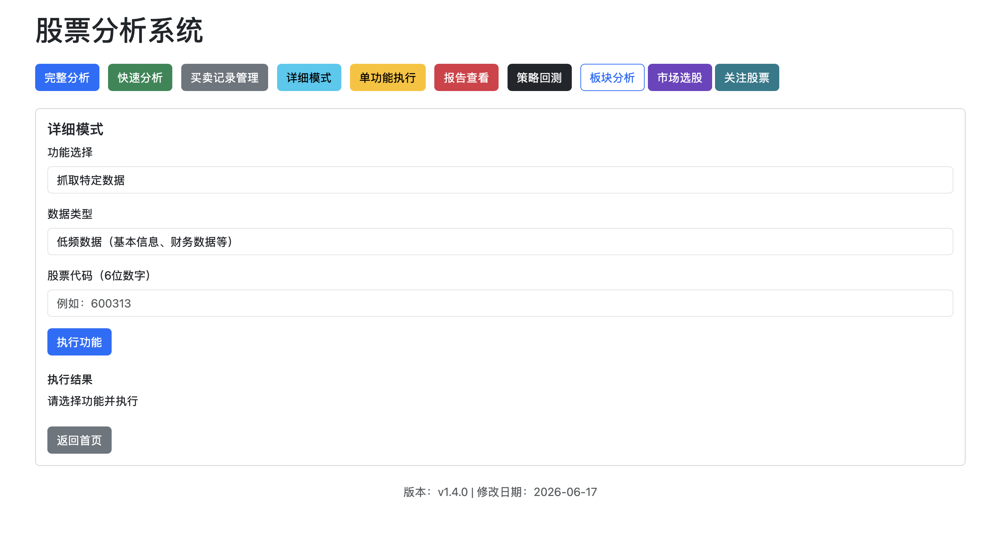
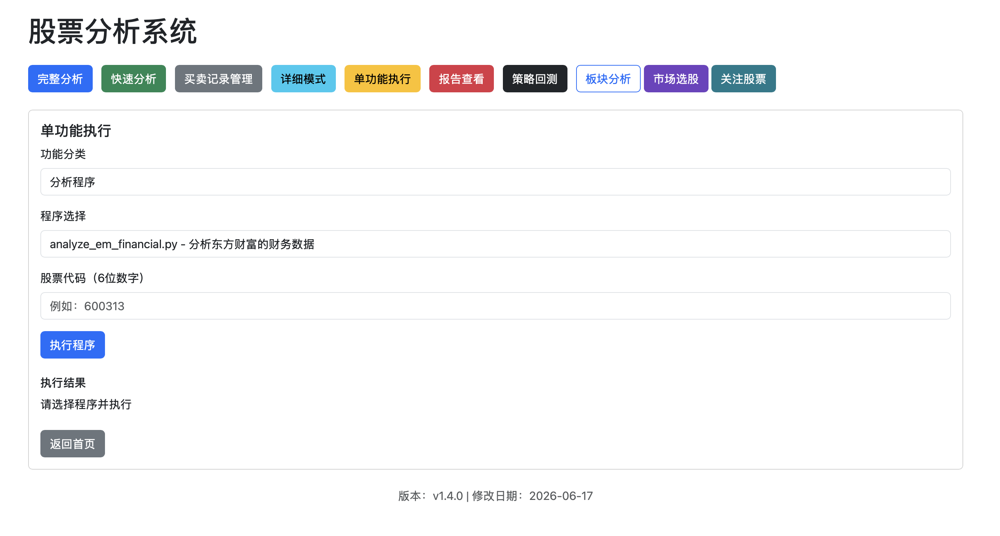
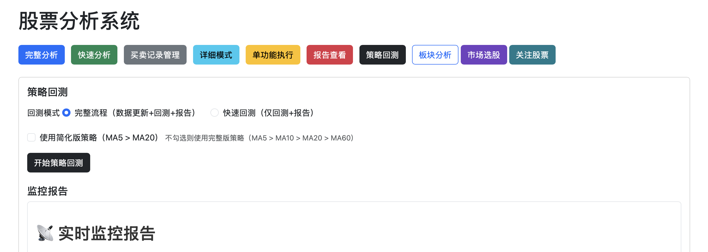
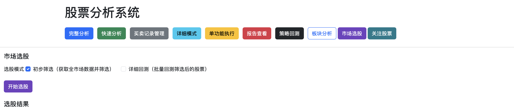
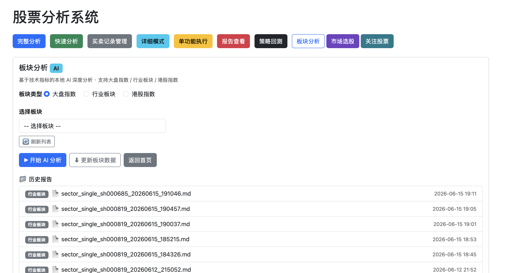
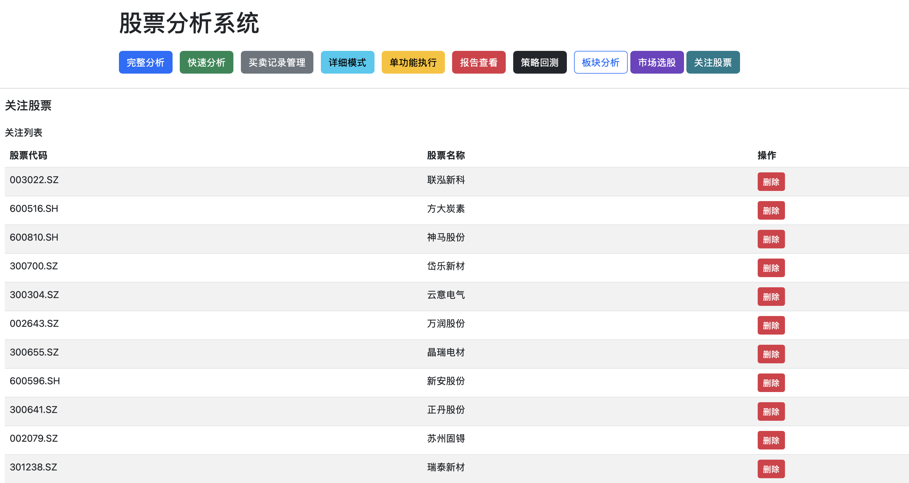
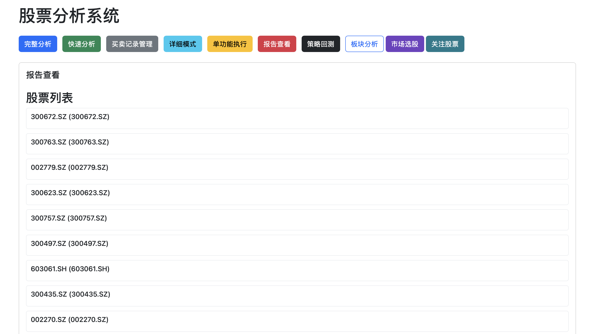
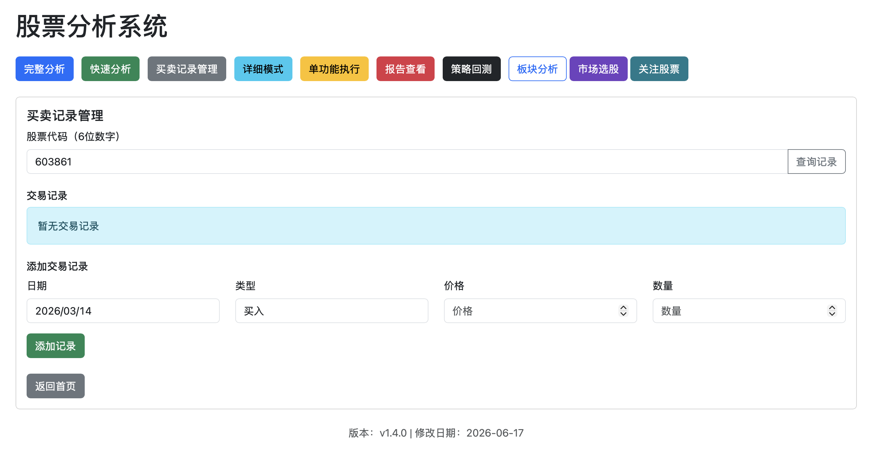

# GP_ANA — A 股 AI 综合分析系统

**当前版本：v1.5.0**

<p align="center">
  
  
  
  
</p>

---

## 📖 这是什么

GP_ANA 是一套跑在你自己电脑上的 **A 股投资决策系统**。

它把散落在各处的股票信息——行情、财报、资金流、融资融券、股东结构、机构研报——自动抓下来，
交给**本地大模型**做多维度研判，最终给出一个明确的、带持仓成本的交易计划。

**一句话概括：把你原本要翻十几个网站、看几十页财报才能拼出的判断，压缩成一份几分钟内可读的报告。**

> **第一次使用？** 直接跳到 [🚀 一步步部署](#-一步步部署从零到跑起来)，跟着做即可，全程约 20 分钟（不含 AI 模型下载）。
>
> **想了解内部实现？** 见 **[Introduction.md](Introduction.md)** —— 架构、算法、数据结构与设计决策的技术详解。

---

## ✨ 项目特点

### 1️⃣ 五维决策 —— 不只看 K 线

单靠开高低收做决策是脆弱的。GP_ANA 同时评估五个维度，每个维度都输出**结构化结论**（看多/看空/中性 + 信心度 + 异常项），而不是一堆原始数字：

| 维度 | 权重 | 它回答什么问题 |
|:---|--:|:---|
| 📈 **技术趋势** | **40%** | 现在是不是趋势？超买超卖了吗？关键价位在哪？ |
| 💰 **财务质量** | 25% | 赚的是真钱吗？增长可持续吗？杠杆危险吗？ |
| 🌡️ **情绪估值** | 15% | 主力在进还是在出？估值处于什么分位？ |
| 🏢 **股东结构** | 10% | 股权集中还是分散？机构在增持还是撤退？ |
| 📰 **研报观点** | 10% | 机构评级分布如何？目标价和盈利预测怎么变？ |

### 2️⃣ 两层 AI 决策 —— 先"吵架"，再下单

这是本系统与普通"报告生成器"最大的区别。

```
第一层：冲突检测
  把五个维度中【相互矛盾】的结论单独拎出来
  角色设定：对冲基金风险经理
  产出：这份矛盾背后的逻辑是什么？最该盯哪个指标？

          ↓ 只把结论和你的真实持仓成本传下去

第二层：交易计划
  角色设定：交易教练
  硬性约束：禁止给模糊建议
  产出："如果股价 3 个交易日内站不稳 27.6 元，减仓至半仓" 这种可执行的情景计划
```

**为什么要这样设计？** 因为把几万字报告直接丢给 AI，它会退化成"摘要器"，遇到互相矛盾的观点就给出骑墙结论。
把矛盾点单独挑出来让 AI 推理，再结合你的**真实盈亏状态**给建议，才是 LLM 的强项所在。

### 3️⃣ 技术为主，其他避雷

其他四个维度**不主动产生买入信号**，只拥有一票否决权。同一套数据，三种用法：

| 模式 | 时间框架 | 技术面 | 财务 | 股东 | 情绪 |
|:---|:---|--:|--:|--:|--:|
| **短期交易** | < 1 个月 | **80%** | 0% | 0% | 20% |
| **中期持仓** | 1–6 个月 | **60%** | 30% | 10% | 0% |
| **长期投资** | > 6 个月 | 20% | **50%** | **30%** | 0% |

避雷线随模式自动调整。例如资产负债率：短期容忍 80%，中期 70%，长期只有 60%。

### 4️⃣ 全部本地推理，数据不出本机

- AI 推理跑在 **本机 Ollama**，**不需要任何云端 API key**
- 行情数据直接取自公开财经接口
- 你的持仓成本、交易记录、分析结果**全部只存在本地**

> 这是刻意的设计：投资决策涉及个人财务状况，不应该上传到任何第三方 AI 服务。

### 5️⃣ 多数据源 + 自动容错

单一数据源出问题就抓瞎。GP_ANA 对关键数据做**多源冗余**：

- 行情同时走新浪财经和 akshare，主源失败自动切备用
- 估值数据有双路回退
- 每个采集步骤独立异常隔离——**某一步失败不会让整个流程崩掉**
- 所有采集器**增量更新**，只拉新数据，不重复下载

### 6️⃣ 全市场选股流水线

不想只盯着自选股？内置一条完整流水线：

```
Tushare 全市场日线  →  合并基础指标  →  多条件筛选  →  逐只趋势回测  →  最终持仓清单
   （5500+ 只）        （市值/PE/PB）    （价格/成交额/      （真实历史回测）
                                        换手率/振幅）
```

### 7️⃣ 策略回测 + 实时监控

- 趋势跟踪策略完整回测，输出资金曲线、夏普比率、最大回撤
- 入离场使用**对称双信号**：入场看趋势确认（多头结构+量能+ADX+MACD），离场看趋势结束（跌破 10 日低点或均线死叉+MACD 转负）
- 离场后 **3 个交易日冷却期**，避免刚卖出又提示买入的自相矛盾
- 保护性止损全保留：时间止损 / 峰值回撤 / ATR 止损 / 移动止盈 / 分仓止盈

### 8️⃣ 20+ 张专业图表自动生成

每只股票自动产出价格成交量、技术指标面板、布林带、相关性热力图、信号有效性分析、
支撑阻力位、趋势通道、AI 价格预测、特征重要性等图表，既能在线看也能导出报告。

### 对比一下

| 特性 | 传统炒股软件 | **GP_ANA** |
|:---|:---|:---|
| 数据来源 | 单一平台 | 20+ 采集器，多源融合 + 自动容错 |
| 分析维度 | 仅 K 线 | **五维**：财务 + 情绪估值 + 技术 + 股东 + 研报 |
| AI 决策 | ❌ | ✅ **两层决策**：冲突检测 → 持仓交易计划 |
| 策略验证 | 手动复盘 | 自动回测 + 实时监控 |
| 市场选股 | 逐个翻找 | 全市场筛选 → 回测 → 最终持仓 |
| 数据隐私 | 上传云端 | ✅ **全本地推理**，持仓不出本机 |
| 成本 | 订阅费 | 免费开源 + 本地模型 |

---

## 🖥️ 界面预览

### 完整分析 & 快速分析
<p align="center">
  
  &nbsp;
  
</p>

### 详细模式 & 单功能执行
<p align="center">
  
  &nbsp;
  
</p>

### 策略回测 & 市场选股
<p align="center">
  
  &nbsp;
  
</p>

### 板块分析 & 关注股票
<p align="center">
  
  &nbsp;
  
</p>

### 报告查看 & 买卖记录管理
<p align="center">
  
  &nbsp;
  
</p>

---

## 🚀 一步步部署（从零到跑起来）

> 全程约 20 分钟。每一步都给出了**具体命令**和**要改哪个文件的哪一行**。

### 第 0 步：先确认你的电脑满足条件

| 项目 | 要求 | 说明 |
|:---|:---|:---|
| **操作系统** | macOS / Linux / Windows | macOS 最省事 |
| **Python** | **3.9 ~ 3.12**（推荐 3.10 / 3.11） | ⚠️ **3.13 不支持**，见下方说明 |
| **内存** | ≥ 8 GB | 跑本地大模型建议 ≥ 32 GB |
| **磁盘** | ≥ 5 GB | 不含 AI 模型；模型本身可能 20 GB+ |
| **网络** | 能访问国内财经站点 | 数据源为东方财富/akshare/新浪/Tushare |

先查一下你的 Python 版本：

```bash
python3 --version
```

> ⚠️ **为什么不能用 Python 3.13？**
> 依赖中锁定了 `numpy==1.26.3`，该版本只提供 Python 3.9 ~ 3.12 的预编译包。
> 在 3.13 上会因找不到 wheel 而尝试源码编译，通常失败。
> 若必须用 3.13，可把 `requirements.txt` 里的 `numpy==1.26.3` 改成 `numpy>=2.1`（未做完整验证）。

版本不合适的话，用 conda 单独建一个环境：

```bash
conda create -n gpana python=3.10 -y
conda activate gpana
```

---

### 第 1 步：下载代码

```bash
git clone https://github.com/Leo-luxy/GP_ANA.git
cd GP_ANA
```

之后所有命令都在这个目录下执行。

---

### 第 2 步：创建虚拟环境

避免污染系统 Python：

```bash
# 创建
python3 -m venv venv

# 激活 —— macOS / Linux
source venv/bin/activate

# 激活 —— Windows
venv\Scripts\activate
```

激活成功后命令行前面会出现 `(venv)`。

---

### 第 3 步：安装 TA-Lib 系统库（最容易卡住的一步）

本项目用 `TA-Lib` 计算 40+ 种技术指标。**它有一个 C 语言底层库，必须先装系统库再装 Python 包**，顺序反了必定失败。

**macOS：**

```bash
brew install ta-lib
```

**Ubuntu / Debian：**（官方源没有现成包，需要源码编译）

```bash
sudo apt-get update
sudo apt-get install -y build-essential wget
wget https://github.com/ta-lib/ta-lib/releases/download/v0.6.4/ta-lib-0.6.4-src.tar.gz
tar -xzf ta-lib-0.6.4-src.tar.gz
cd ta-lib-0.6.4/
./configure --prefix=/usr
make
sudo make install
cd ..
```

**Windows：** 下载预编译包最省事（选与你 Python 版本、系统位数匹配的文件）：

```
https://github.com/cgohlke/talib-build/releases
```

```bash
pip install TA_Lib-0.6.8-cp310-cp310-win_amd64.whl
```

**装完验证一下**（能打印版本号才算成功）：

```bash
python3 -c "import talib; print(talib.__version__)"
```

> 这一步不通过就不要往下走，否则后面所有技术分析功能都会崩。

---

### 第 4 步：安装 Python 依赖

```bash
pip install -r requirements.txt
```

约需 3~10 分钟，**无需再手动补装任何东西**（`flask` 已包含在内）。

个别包失败可以单独重试，例如：

```bash
pip install akshare==1.18.39
```

---

### 第 5 步：安装并启动 Ollama（AI 功能必需）⭐

所有 AI 分析、五维研判、两层决策都依赖本地大模型。

**1）安装 Ollama** —— 访问 <https://ollama.com/download>，或 macOS 用 `brew install ollama`

**2）启动服务**

```bash
ollama serve
```

服务监听 `http://localhost:11434`。**建议让它常驻**（macOS 可用 `brew services start ollama`）。

**3）下载一个模型**

> ⚠️ **注意**：`config.example.py` 里默认写的模型名是作者本机的自定义模型，**在 Ollama 公共仓库里不存在**，
> 直接 `ollama pull` 会失败。请自己拉一个可用模型，然后把配置改成对应的名字（下一步会讲）。

```bash
# 按你的内存选一个
ollama pull qwen3:8b          # 约 5 GB，8GB 内存可跑，速度快
ollama pull qwen3:32b         # 约 20 GB，效果更好，建议 32GB+ 内存
ollama pull deepseek-r1:32b   # 备选
```

**4）确认模型就绪**

```bash
ollama list
```

**记下你拉取的模型名字**，下一步要用。

---

### 第 6 步：创建配置文件 `config.py` ⭐

仓库里**没有** `config.py`（它含个人股票池，已被 `.gitignore` 排除），只提供了模板。
**这一步要做的就是复制模板 + 改两处。**

**复制模板：**

```bash
# macOS / Linux
cp config.example.py config.py

# Windows
copy config.example.py config.py
```

**然后编辑 `config.py`，至少改这两处：**

**① `STOCK_TICKERS` —— 填你要分析的股票**

```python
# config.py 第 9 行附近
STOCK_TICKERS = {
    'byd':    '002594.SZ',   # 键名随便起，值必须是「6位代码 + 交易所后缀」
    'lanxi':  '300433.SZ',
    # 可以继续加
}
```

> **交易所后缀规则**：`6` 开头 → `.SH`（上交所）；`0` / `3` 开头 → `.SZ`（深交所）。

**② `AI_CONFIG.model` —— 填你第 5 步实际拉取的模型名**

```python
# config.py 第 57 行附近
AI_CONFIG = {
    'base_url': 'http://localhost:11434',   # Ollama 地址，本机不用改
    'model': 'qwen3:8b',                    # ← 改成你自己的模型名
    'temperature': 0.3,
    'max_tokens': 8192,
    'trading_strategy': 'neutral',          # 见下方说明
    'fallback_models': ['qwen3:8b'],        # ← 同上
}
```

`trading_strategy` 可选四种，决定 AI 用什么视角看盘：

| 取值 | 含义 |
|:---|:---|
| `neutral` | 中性客观（默认），综合多空信号给判断 |
| `trend_following` | 趋势跟踪，只在有明显趋势时交易 |
| `mean_reversion` | 均值回归，在极端位置反向交易 |
| `swing` | 波段交易，持仓数天至数周 |

---

### 第 7 步：创建持仓记录 `trading_records.py`（可选但强烈建议）

**为什么建议填：** 第二层 AI 决策会读取你的**真实持仓成本和盈亏**。
不填也能用，但 AI 只能空谈基本面；填了它才会给出"你现在亏 27%，该止损还是补仓"这种针对性建议。

**复制模板：**

```bash
# macOS / Linux
cp trading_records.example.py trading_records.py

# Windows
copy trading_records.example.py trading_records.py
```

**然后编辑 `trading_records.py`，按格式填你的真实买卖记录：**

```python
# trading_records.py
TRADING_RECORDS = {
    '600519.SH': [
        {'date': '2026-01-15', 'type': 'buy',  'price': 1500.00, 'shares': 100},
        {'date': '2026-02-20', 'type': 'sell', 'price': 1580.00, 'shares': 50},
    ],
    '000858.SZ': [
        {'date': '2026-03-01', 'type': 'buy',  'price': 130.00, 'shares': 500},
    ],
}
```

| 字段 | 说明 |
|:---|:---|
| `date` | 成交日期，格式 `YYYY-MM-DD` |
| `type` | `buy` 买入 / `sell` 卖出 |
| `price` | 成交价 |
| `shares` | 成交股数 |

> 也可以不建这个文件，直接在 `config.py` 里用 `TRADING_RECORDS = {...}` 定义，并把 `from trading_records import TRADING_RECORDS` 那行注释掉。
>
> 💡 也可以在 Web 界面「买卖记录管理」里直接增删，无需手改文件。

---

### 第 8 步：配置 Tushare Token（**仅"市场选股"功能需要**）⭐

**这是本系统唯一需要申请的凭据。** 其余数据源（akshare、东方财富、新浪财经）都是免费公开接口，**无需任何密钥**；
AI 走本地 Ollama，也**不需要**任何云端 API key。

**如果你不用「市场选股」，直接跳过这一步。**

**1）申请**：注册并登录 <https://tushare.pro/> → 「个人主页 → 接口 TOKEN」→ 复制你的 token

**2）填进两个文件**（注意是**两个**）：

```python
# stocks_filter/step1_daily.py 第 15 行
TUSHARE_TOKEN = "YOUR_TUSHARE_TOKEN"     # ← 替换成你的真实 token
```

```python
# stocks_filter/step2_daily_basic.py 第 14 行
TUSHARE_TOKEN = "YOUR_TUSHARE_TOKEN"     # ← 换成同一个 token
```

**3）注意 Tushare 积分**：全市场日线接口（`pro.daily()`）需要 **120 积分以上**。
新账号默认积分不够，会提示权限不足，需先在 Tushare 官网完成积分任务。

> ⚠️ **安全提醒**：这两个文件**是被 git 跟踪的**。如果你打算把自己的改动提交回公开仓库，
> 请务必先把 token 改回 `YOUR_TUSHARE_TOKEN`，或改用环境变量注入。详见 [安全注意事项](#-安全注意事项)。

---

### 第 9 步：创建数据目录

程序不会自动创建这两个目录，**必须手动建**：

```bash
mkdir -p data log
```

- `data/` —— 所有行情数据、分析报告、图表都存在这里
- `log/` —— 运行日志

---

### 第 10 步：启动 Web 界面

```bash
python web_ui.py
```

看到下面这行就说明成功了：

```
 * Running on http://0.0.0.0:8081
```

**打开浏览器访问：<http://localhost:8081>**

> ⚠️ 端口是 **8081**（不是 5000），且**当前版本硬编码在 `web_ui.py` 最后一行，不支持命令行改端口**。
> 8081 被占用时请直接编辑那一行的 `port=8081`。

---

### 第 11 步：首次使用（按顺序操作）

> ⚠️ **顺序很重要**，跳过会导致页面空白。

| 顺序 | 操作 | 说明 |
|:---:|:---|:---|
| 1️⃣ | **先采集板块数据** | 点击「板块分析 → 更新板块数据」。**首次必须做**，否则板块列表是空的 |
| 2️⃣ | **添加关注股票** | 点击「关注股票」添加。后续回测/分析会优先使用这个列表 |
| 3️⃣ | **跑一次完整分析** | 点击「完整分析」输入股票代码，耗时 3~5 分钟，建立第一份完整画像 |
| 4️⃣ | 日常使用 | 「快速分析」30 秒出结果；想找新股时用「市场选股」 |

各功能耗时参考：

| 模式 | 耗时 | 适用场景 |
|:---|:---|:---|
| 🔍 完整分析 | 3-5 分钟 | 新股票首次全面评估（五维 + 两层决策） |
| ⚡ 快速分析 | 30 秒 | 每日盘后快速复盘（仅技术面） |
| 📊 策略回测 | 1-2 分钟 | 验证策略有效性 |
| 🏢 板块分析 | 2-3 分钟 | 大盘 / 行业 / 概念 / 港股 AI 深度分析 |
| 🎯 市场选股 | 3-5 分钟 | 全市场筛选 → 回测 → 最终持仓（需 Tushare token） |
| ⭐ 关注股票 | 即时 | 管理关注列表 |

---

### 第 12 步：命令行初始化数据（可选）

不想先点界面、想直接用命令行把数据准备好：

```bash
# 抓取并更新日更数据（行情 / 资金流 / 融资融券 / 估值 / 技术指标）
python check_data_updates.py --mode daily --ticker 300433.SZ

# 抓取低频数据（公司信息 / 财报 / 股东 / 北向资金）
python check_data_updates.py --mode periodic --ticker 300433.SZ

# 板块数据
python sector_data_collector.py --type broad_index
python sector_data_collector.py --type industry --top 30
```

不加 `--ticker` 则处理 `config.py` 里 `STOCK_TICKERS` 的全部股票。

---

## 📁 哪个文件写什么（速查表）

部署完成后你只需要关心这几个文件：

| 文件 | 从哪来 | 你要改什么 | 必须吗 |
|:---|:---|:---|:---:|
| **`config.py`** | 复制 `config.example.py` | ① `STOCK_TICKERS` 填股票代码<br>② `AI_CONFIG.model` 填模型名 | ✅ **必须** |
| **`trading_records.py`** | 复制 `trading_records.example.py` | 按格式填真实买卖记录 | 建议 |
| **`stocks_filter/step1_daily.py`** | 仓库自带 | 第 15 行 `TUSHARE_TOKEN` | 仅市场选股 |
| **`stocks_filter/step2_daily_basic.py`** | 仓库自带 | 第 14 行 `TUSHARE_TOKEN` | 仅市场选股 |
| **`watchlist.py`** | 仓库自带 | 关注股票列表（建议用 Web 界面改） | 否 |
| `data/`、`log/` | 手动创建 | —— | ✅ **必须** |

**其他可调参数**（都在 `config.py` 里，不改也能跑）：

| 配置块 | 作用 |
|:---|:---|
| `HISTORY_DATE_RANGE` | 指定某只股票的历史数据区间（默认全量） |
| `TECHNICAL_INDICATORS` | 技术指标周期（MA/RSI/MACD/KDJ 等） |
| `STRATEGY_CONFIG` | 回测参数（初始资金、买卖阈值） |
| `STRATEGY_PROMPTS` | 四种策略视角的提示词模板，可自行调优 |

> 📌 **`config.py` 和 `trading_records.py` 含你的个人持仓信息，已在 `.gitignore` 中，不会被提交。**

---

## 🔧 常见问题排查

### Q1: `pip install TA-Lib` 报错，提示找不到 `ta_lib.h`

**原因**：只装了 Python 包，没装底层 C 库。

**解决**：回到 [第 3 步](#第-3-步安装-ta-lib-系统库最容易卡住的一步) 先装系统库，再 `pip install TA-Lib==0.6.8`。

---

### Q2: 启动报 `ModuleNotFoundError: No module named 'flask'`

**原因**：旧版本的 `requirements.txt` 漏列了 `flask`（**当前版本已修复**）。

**解决**：

```bash
pip install flask
```

---

### Q3: 在 Python 3.13 上安装失败（numpy 编译报错）

**原因**：`numpy==1.26.3` 不支持 Python 3.13。

**解决**：改用 Python 3.9 ~ 3.12；或把依赖改成 `numpy>=2.1` 后重装（未做完整验证）。

---

### Q4: 浏览器打不开 / 端口不通

1. 端口是 **8081**，访问 <http://localhost:8081>
2. 检查占用：`lsof -i :8081`（Windows 用 `netstat -ano | findstr :8081`）
3. 改端口：编辑 `web_ui.py` 最后一行

---

### Q5: AI 分析一直失败或超时

1. Ollama 是否在跑：`ollama list`，报连接错误就先 `ollama serve`
2. `config.py` 里的 `AI_CONFIG.model` 是否与你实际拉取的模型名**完全一致**（最常见原因）
3. 模型太大导致太慢：换小模型，如 `qwen3:8b`
4. 首次加载模型需要时间，耐心等一下

---

### Q6: 板块分析页面的板块列表是空的

**原因**：板块数据尚未采集，首次必须初始化。

**解决**：界面点「板块分析 → 更新板块数据」，或命令行：

```bash
python sector_data_collector.py --type broad_index
python sector_data_collector.py --type industry --top 30
```

---

### Q7: 市场选股提示 Tushare 权限不足

**原因**：`pro.daily()` 需要 **120 积分以上**，新账号默认不够。

**解决**：到 <https://tushare.pro/> 完成积分任务或升级；并确认 token 已填入**两个**文件。

---

### Q8: 抓取数据报网络错误 / 超时

1. 检查能否访问东方财富、新浪财经
2. **关闭系统代理或 VPN**（代码已主动清理代理环境变量，但全局代理仍可能干扰）
3. 升级 akshare：`pip install --upgrade akshare`
4. 稍后重试——数据接口有频率限制

---

### Q9: 找不到 `config.py`

**原因**：出于隐私考虑，`config.py` 与 `trading_records.py` 不包含在仓库中。

**解决**：见 [第 6 步](#第-6-步创建配置文件-configpy-) 与 [第 7 步](#第-7-步创建持仓记录-trading_recordspy可选但强烈建议) 复制模板。

---

## ⚠️ 安全注意事项

### 🔴 部署前必读

**1）`web_ui.py` 以 Flask debug 模式监听 `0.0.0.0`**

当前版本使用 `app.run(host='0.0.0.0', port=8081, debug=True)`，这意味着：

- `debug=True` 会启用 Werkzeug 调试器，出错页面提供**可执行任意代码**的交互式控制台
- `host='0.0.0.0'` 表示监听**所有网卡**，同一局域网内其他设备可以访问

**⚠️ 请勿在公网或不可信网络中运行。** 长期运行建议改成：

```python
# web_ui.py 最后一行
app.run(host='127.0.0.1', port=8081, debug=False)   # 仅本机可访问，关闭调试器
```

**2）Tushare token 不要提交到公开仓库**

`stocks_filter/step1_daily.py` 和 `stocks_filter/step2_daily_basic.py` **是被 git 跟踪的文件**。
填入真实 token 后一旦 `git commit`，token 就永久留在了 commit 历史里。

- 提交前务必改回 `"YOUR_TUSHARE_TOKEN"`
- 更稳妥的写法是改用环境变量：

```python
import os
TUSHARE_TOKEN = os.environ.get("TUSHARE_TOKEN", "")
```

- 若已误提交，请立即到 Tushare 官网**重置 token**

**3）`config.py` 与 `trading_records.py` 含个人持仓隐私**

这两个文件已在 `.gitignore` 中，**请勿取消忽略或手动提交**。

**4）`data/` 目录含全部分析结果与持仓决策**

同样已在 `.gitignore` 中。分享或打包本项目前建议清空：

```bash
rm -rf data/*      # ⚠️ 会删除所有已生成的分析报告与图表
```

### 🟢 良好的隐私设计

值得肯定的是，本项目**所有 AI 推理都在本地 Ollama 完成**，行情数据直接取自公开财经接口，
**不会把你的持仓或分析结果上传到任何第三方 AI 服务**。

### 其他建议

1. 不要在公共网络环境下暴露服务端口
2. 定期更新依赖：`pip install -r requirements.txt --upgrade`
3. 数据目录权限设为仅当前用户可读写：`chmod 700 data`

---

## 💻 命令行速查

```bash
# 启动 Web 界面
python web_ui.py

# 数据更新
python check_data_updates.py --mode daily    --ticker 300433.SZ   # 日更数据
python check_data_updates.py --mode periodic --ticker 300433.SZ   # 低频数据

# 批量分析
python batch_analyze.py --mode daily    --ticker 300433.SZ   # 日更维度（6 步）
python batch_analyze.py --mode periodic --ticker 300433.SZ   # 低频维度（3 步）
python batch_analyze.py --mode all      --ticker 300433.SZ   # 完整流程（14 步）

# 技术趋势分析（可切换策略视角）
python analyze_technical_trend.py --strategy trend_following --ticker 300433.SZ
python analyze_technical_trend.py --strategy swing           --ticker 300433.SZ

# 板块分析
python sector_data_collector.py --type broad_index            # 采集大盘指数
python sector_data_collector.py --type industry --top 30      # 采集行业板块
python analyze_sector.py --mode single --sector BK0477        # 单板块深度分析
python analyze_sector.py --mode broad                         # 大盘全景分析

# 市场选股（四步流水线，需先填 Tushare token）
python stocks_filter/step1_daily.py           # 1. 全市场日线
python stocks_filter/step2_daily_basic.py     # 2. 合并基础指标（建议等 step1 完成 1 小时）
python stocks_filter/step3_filter.py          # 3. 多条件筛选
python stocks_filter/batch_backtest_filter.py # 4. 批量回测 → final_holdings.csv
```

不加 `--ticker` 时，批量命令会处理 `config.py` 中 `STOCK_TICKERS` 的全部股票。

> 更多模块与接口说明见 [Introduction.md](Introduction.md)。

---

## 📄 版本历史

| 版本 | 日期 | 主要变更 |
|------|------|---------|
| **v1.5.0** | 2026-09 | 文档体系重构为 README + Introduction 两册、回测页默认显示最新报告、任务状态持久化、依赖清单修正、清理冗余脚本 |
| **v1.4.0** | 2026-06 | 市场选股+自选股管理、KDJ/板块时效性修复、回测增强（关注列表+公司名）、超时控制 |
| **v1.3.0** | 2026-06 | 板块分析：四大类型 AI 分析、新浪财经数据源、sector API |
| **v1.2.0** | 2026-05 | 架构重构：统一入口、Process/引擎、两层决策、快速分析、回测系统 |
| v1.1.0 | 2026-03 | 41 模块：Web 界面、12 个新采集器、5 个新分析引擎 |
| v1.0.1 | 2026-02 | 18 模块：数据采集 + 基础分析 |

详见 [CHANGELOG.md](CHANGELOG.md)

---

## 📚 相关文档

| 文档 | 说明 |
|:---|:---|
| [**Introduction.md**](Introduction.md) | **技术详解** —— 系统架构、五维决策算法、模块技术档案、数据字典、API 参考、设计决策 |
| [CHANGELOG.md](CHANGELOG.md) | 版本变更记录 |
| [CONTRIBUTING.md](CONTRIBUTING.md) | 贡献指南 |
| [SECURITY.md](SECURITY.md) | 安全政策 |
| [CODE_OF_CONDUCT.md](CODE_OF_CONDUCT.md) | 行为准则 |

---

## 📜 许可证

本项目采用 [MIT License](LICENSE)。

---

## ⚖️ 免责声明

本项目为**技术学习与研究工具**。所有 AI 分析结果、交易建议、回测数据**均不构成任何投资建议**。
股市有风险，投资需谨慎。使用本项目产生的任何投资决策及其后果，由使用者自行承担。

---

<p align="center">
  <sub>Made with ❤️ for quantitative investors</sub>
</p>
